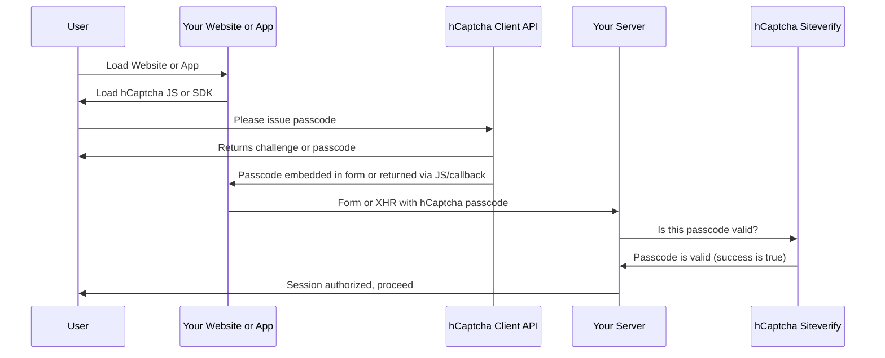
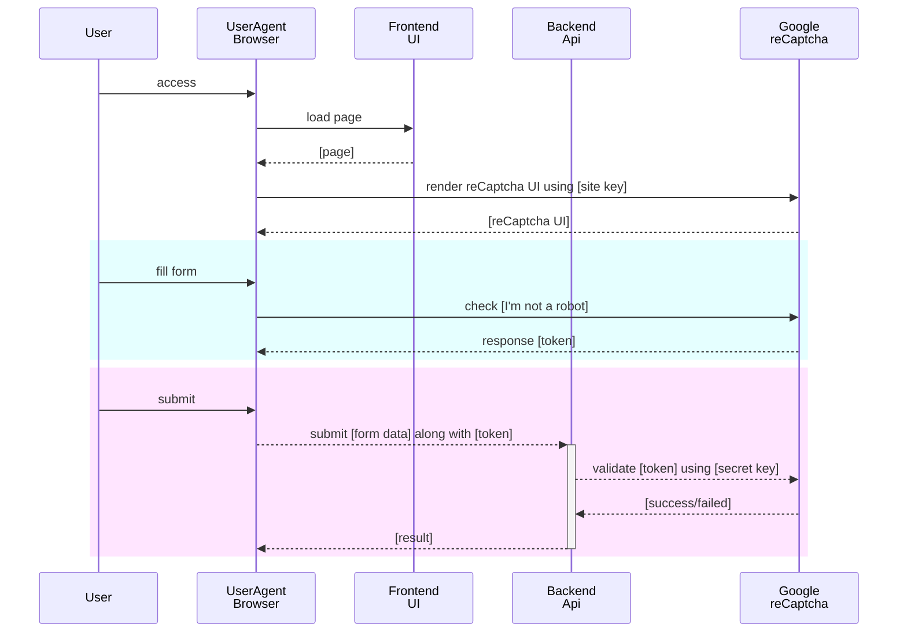

```mermaid
sequenceDiagram
participant User
participant Your Website or App
participant hCaptcha Client API
participant Your Server
participant hCaptcha Siteverify
User->>Your Website or App: Load Website or App
Your Website or App->>User: Load hCaptcha JS or SDK
User->>hCaptcha Client API: Please issue passcode
hCaptcha Client API->>User: Returns challenge or passcode
hCaptcha Client API->>Your Website or App: Passcode embedded in form or returned via JS/callback
Your Website or App->>Your Server: Form or XHR with hCaptcha passcode
Your Server->>hCaptcha Siteverify: Is this passcode valid?
hCaptcha Siteverify->>Your Server: Passcode is valid (success is true)
Your Server->>User: Session authorized, proceed
```

```mermaid
%%{init: {'securityLevel': 'loose', 'theme':'default',  'sequence': {'showSequenceNumbers': false,'mirrorActors':true}}}%%
sequenceDiagram
participant U as User
participant B as UserAgent<br/>Browser
participant F as Frontend<br/>UI
participant A as Backend<br/>Api
participant G as Google<br/>reCaptcha

U ->> B: access
B ->> F: load page
F -->> B: [page]
B ->> G: render reCaptcha UI using [site key]
G -->> B: [reCaptcha UI]

rect rgba(0, 255, 255, .1)
  U ->> B: fill form
  B ->> G: check [I'm not a robot]
  G -->> B: response [token]
end

rect rgba(255, 0, 255, .1)
  U ->> B: submit
  B -->>+ A: submit [form data] along with [token]
  A -->> G: validate [token] using [secret key]
  G -->> A: [success/failed]
  A -->>- B: [result]
end

```
